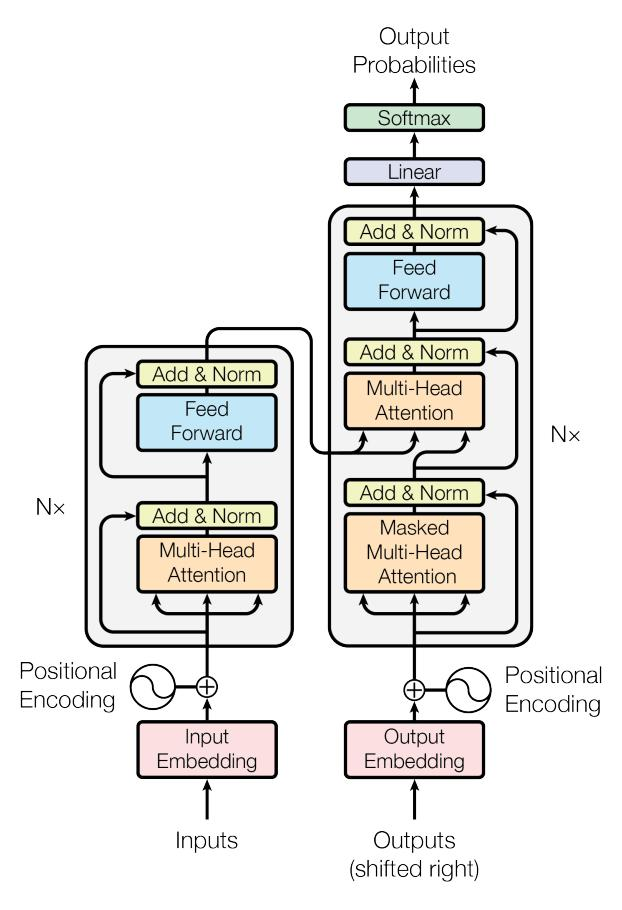
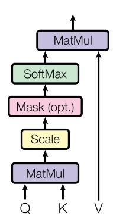
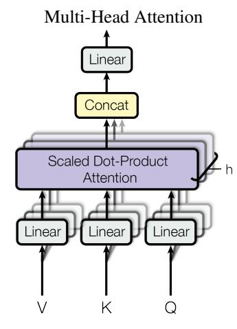

# Attention Is All You 

Il lavoro introduce il **Transformer**, un'architettura per la trasduzione di sequenze (**sequence transduction**) basata esclusivamente su meccanismi di **attenzione (attention)**, senza utilizzare né reti ricorrenti né convoluzioni. 

## Abstract

Prima del Transformer, i principali modelli per la trasduzione di sequenze erano costruiti con **reti neurali ricorrenti (Recurrent Neural Networks, RNN)** o **reti neurali convoluzionali (Convolutional Neural Networks, CNN)** organizzate secondo una struttura **encoder-decoder**. I sistemi migliori integravano inoltre un meccanismo di attenzione per collegare encoder e decoder.

Il Transformer elimina completamente ricorrenza e convoluzioni e utilizza soltanto meccanismi di attenzione. Questa scelta rende il modello molto più parallelizzabile durante l'addestramento e permette di ridurre significativamente i tempi di training.

Nei task di traduzione automatica (**machine translation**) WMT 2014:

* inglese $\rightarrow$ tedesco: il modello raggiunge **28,4 BLEU**, migliorando di oltre 2 punti BLEU rispetto ai precedenti migliori risultati, inclusi gli ensemble;
* inglese $\rightarrow$ francese: raggiunge **41,0 BLEU** con un singolo modello, dopo circa **3,5 giorni di training su 8 GPU**.

# 1. Introduzione

Le RNN, e in particolare le **Long Short-Term Memory (LSTM)** e le **Gated Recurrent Unit / gated recurrent neural networks**, rappresentavano gli approcci principali per problemi di **modellazione di sequenze (sequence modeling)** e trasduzione, come il **language modeling** e la traduzione automatica.

Il problema fondamentale delle architetture ricorrenti deriva dalla loro natura sequenziale. A ogni posizione $t$, lo stato nascosto $h_t$ dipende dallo stato precedente $h_{t-1}$ e dall'input corrispondente alla posizione corrente. Concettualmente:

$h_t = f(h_{t-1}, x_t)$.

Di conseguenza, $h_t$ non può essere calcolato prima di $h_{t-1}$. Questa dipendenza impedisce la piena parallelizzazione delle operazioni appartenenti alla stessa sequenza durante il training.

Il problema diventa particolarmente importante per sequenze lunghe: la memoria disponibile limita anche il numero di esempi che possono essere elaborati contemporaneamente in un batch.

Tecniche come la fattorizzazione delle operazioni e la **computazione condizionale (conditional computation)** miglioravano l'efficienza, ma non eliminavano la dipendenza sequenziale fondamentale delle RNN.

I meccanismi di **attenzione (attention mechanisms)** avevano già mostrato la capacità di modellare dipendenze indipendentemente dalla distanza tra gli elementi della sequenza. Tuttavia, prima del Transformer erano generalmente utilizzati insieme a una rete ricorrente.

L'idea centrale del lavoro consiste quindi nel sostituire completamente la ricorrenza con l'attenzione. Il Transformer utilizza l'attenzione per stabilire direttamente dipendenze globali tra gli elementi dell'input e dell'output.

Questa architettura permette una parallelizzazione molto maggiore e, negli esperimenti originali, raggiunge risultati allo stato dell'arte nella traduzione dopo appena **12 ore di training su 8 GPU NVIDIA P100**.

# 2. Background

Anche architetture precedenti come **Extended Neural GPU**, **ByteNet** e **ConvS2S** cercavano di ridurre la quantità di computazione sequenziale. Questi modelli impiegavano CNN per calcolare in parallelo le rappresentazioni delle diverse posizioni.

Rimaneva però un problema relativo alla distanza tra due elementi della sequenza.

In ConvS2S, il numero di operazioni necessarie affinché due posizioni distanti possano interagire cresce linearmente con la loro distanza; in ByteNet cresce invece in maniera logaritmica. Percorsi computazionali più lunghi possono rendere più difficile l'apprendimento delle **dipendenze a lungo raggio (long-range dependencies)**.

Nel Transformer, grazie alla **self-attention**, qualsiasi posizione può interagire direttamente con qualsiasi altra posizione all'interno dello stesso layer. Il numero di operazioni sequenziali necessarie per mettere in relazione due posizioni diventa quindi costante.

Un possibile svantaggio consiste nell'aggregazione di informazioni provenienti da più posizioni attraverso una media pesata dall'attenzione. Il Transformer compensa questa perdita di risoluzione mediante la **Multi-Head Attention**.

## Self-attention

La **self-attention**, chiamata anche **intra-attention**, mette in relazione diverse posizioni appartenenti alla stessa sequenza per costruirne una rappresentazione.

Era già stata utilizzata con successo in task quali:

* comprensione del testo (**reading comprehension**);
* riassunto astrattivo (**abstractive summarization**);
* inferenza o implicazione testuale (**textual entailment**);
* apprendimento di rappresentazioni delle frasi indipendenti dal task.

Le **end-to-end memory networks** utilizzavano inoltre un meccanismo ricorrente di attenzione e avevano mostrato buoni risultati nel question answering e nel language modeling.

La caratteristica distintiva del Transformer consiste nell'essere un modello di trasduzione basato **interamente sulla self-attention**, senza RNN allineate alle posizioni della sequenza e senza convoluzioni.

# 3. Architettura del modello

La maggior parte dei modelli di trasduzione neurale utilizza una struttura **encoder-decoder**.

Data una sequenza di input

$(x_1,\ldots,x_n)$,

l'encoder produce una sequenza di rappresentazioni continue

$z=(z_1,\ldots,z_n)$.

A partire da $z$, il decoder genera la sequenza di output

$(y_1,\ldots,y_m)$

un simbolo alla volta.

Il decoder è **autoregressivo (autoregressive)**: durante la generazione del simbolo successivo utilizza anche i simboli già generati.

Il Transformer mantiene questa struttura generale, ma encoder e decoder vengono costruiti utilizzando principalmente:

* self-attention;
* Multi-Head Attention;
* reti feed-forward applicate indipendentemente a ogni posizione.

{width=30%}

**Figura 1 — Architettura del Transformer.** La metà sinistra rappresenta l'encoder, mentre quella destra rappresenta il decoder.

## 3.1 Encoder e decoder

### Encoder
L'encoder consiste in uno stack di $N=6$ layer identici.

Ogni layer contiene due sottolayer:

1. **Multi-Head Self-Attention**;
2. rete **feed-forward position-wise**, completamente connessa.

Attorno a ciascun sottolayer viene applicata una **connessione residua (residual connection)**, seguita da **normalizzazione di layer (Layer Normalization)**.

L'operazione complessiva è:

$\operatorname{LayerNorm}(x+\operatorname{Sublayer}(x))$,

dove $\operatorname{Sublayer}(x)$ rappresenta la trasformazione eseguita dal particolare sottolayer.

Per poter sommare direttamente l'ingresso $x$ e l'uscita del sottolayer, tutti i sottolayer e gli embedding producono vettori della stessa dimensionalità:

$d_{\text{model}}=512$.

### Decoder

Anche il decoder contiene $N=6$ layer identici.

Ogni layer possiede però **tre** sottolayer:

1. Multi-Head Self-Attention sul decoder;
2. Multi-Head Attention sulle rappresentazioni prodotte dall'encoder;
3. rete feed-forward position-wise.

Come nell'encoder, ciascun sottolayer utilizza connessioni residuali e Layer Normalization.

La self-attention del decoder viene inoltre modificata per impedire a una posizione di accedere alle posizioni future. Si utilizza quindi una **maschera causale (causal mask)**.

In combinazione con lo spostamento di una posizione degli embedding di output, questo garantisce che la predizione alla posizione $i$ possa dipendere solamente dagli output delle posizioni precedenti a $i$.

# 3.2 Attention

Una funzione di attenzione riceve:

* una **query**;
* un insieme di **keys**;
* i corrispondenti **values**.

Query, keys, values e output sono rappresentati come vettori.

L'output viene calcolato come somma pesata dei values. Il peso assegnato a ciascun value dipende dalla compatibilità tra la query e la key corrispondente.

## 3.2.1 Scaled Dot-Product Attention

Il Transformer utilizza la **Scaled Dot-Product Attention**.

Le query e le keys hanno dimensionalità $d_k$, mentre i values hanno dimensionalità $d_v$.

Per una query $q$ e una key $k$, viene inizialmente calcolato il prodotto scalare $q\cdot k$. Il risultato viene poi diviso per $\sqrt{d_k}$ e trasformato mediante softmax.

In pratica, le query vengono raccolte nella matrice $Q$, le keys nella matrice $K$ e i values nella matrice $V$.

La funzione è:

$$
\operatorname{Attention}(Q,K,V)
=
\operatorname{softmax}\left(\frac{QK^T}{\sqrt{d_k}}\right)V
$$

Il prodotto $QK^T$ genera una matrice contenente i punteggi di compatibilità tra tutte le query e tutte le keys.

La divisione per $\sqrt{d_k}$ costituisce la principale differenza rispetto alla normale **dot-product attention**, detta anche **multiplicative attention**.

Un'altra tecnica nota è l'**additive attention**, nella quale la compatibilità viene calcolata tramite una rete feed-forward con un singolo hidden layer.

Dot-product attention e additive attention hanno una complessità teorica simile, ma la prima è più veloce e più efficiente in termini di memoria perché può sfruttare implementazioni altamente ottimizzate della moltiplicazione matriciale.

{width=20%}
{width=20%}

**Figura 2 — A sinistra:** Scaled Dot-Product Attention. **A destra:** Multi-Head Attention, costituita da più funzioni di attention eseguite in parallelo.

### Perché dividere per $\sqrt{d_k}$?

Quando $d_k$ aumenta, il prodotto scalare tra query e key tende ad assumere valori di modulo sempre maggiore.

Supponendo che le componenti di $q$ e $k$ siano variabili casuali indipendenti con media $0$ e varianza $1$:

$q\cdot k=\sum_{i=1}^{d_k}q_i k_i$.

Il prodotto scalare ha:

* media $0$;
* varianza $d_k$.

La sua deviazione standard cresce quindi come $\sqrt{d_k}$.

Valori molto grandi inviati alla softmax possono portarla nelle regioni di saturazione, dove i gradienti diventano estremamente piccoli. Il fattore $1/\sqrt{d_k}$ normalizza la scala dei prodotti scalari e riduce questo problema.

## 3.2.2 Multi-Head Attention

Invece di applicare una sola funzione di attention utilizzando direttamente query, keys e values con dimensionalità $d_{\text{model}}$, il Transformer crea $h$ diverse proiezioni lineari apprese.

Per ogni testa (**attention head**) vengono ottenute:

* query di dimensione $d_k$;
* keys di dimensione $d_k$;
* values di dimensione $d_v$.

Ogni testa esegue autonomamente la Scaled Dot-Product Attention. Gli output delle diverse teste vengono poi concatenati e sottoposti a un'ulteriore trasformazione lineare.

Formalmente:

$$
\begin{aligned}
\operatorname{MultiHead}(Q,K,V)
&=
\operatorname{Concat}(\operatorname{head}_1,\ldots,\operatorname{head}_h)W^O,\\
\operatorname{head}_i
&=
\operatorname{Attention}(QW_i^Q,KW_i^K,VW_i^V).
\end{aligned}
$$

Le matrici di proiezione hanno dimensioni:

$W_i^Q\in\mathbb{R}^{d_{\text{model}}\times d_k}$,

$W_i^K\in\mathbb{R}^{d_{\text{model}}\times d_k}$,

$W_i^V\in\mathbb{R}^{d_{\text{model}}\times d_v}$,

$W^O\in\mathbb{R}^{hd_v\times d_{\text{model}}}$.

Nel Transformer base:

$h=8$,

$d_k=d_v=\frac{d_{\text{model}}}{h}=\frac{512}{8}=64$.

La Multi-Head Attention consente al modello di concentrarsi contemporaneamente su informazioni appartenenti a **diversi sottospazi di rappresentazione** e a differenti posizioni della sequenza.

Una singola testa, invece, tende a combinare queste informazioni in un'unica media pesata.

Poiché ogni testa opera su una dimensionalità ridotta, l'uso di otto teste non comporta un costo otto volte superiore: il costo totale rimane comparabile a quello di una singola attention head che operasse sull'intera dimensionalità $d_{\text{model}}$.

## 3.2.3 Utilizzi dell'attention nel Transformer

Il Transformer utilizza la Multi-Head Attention in tre modi differenti.

### Encoder-decoder attention

Le queries provengono dal layer precedente del decoder, mentre keys e values provengono dall'output dell'encoder.

In questo modo ogni posizione del decoder può accedere a **tutte le posizioni della sequenza di input**.

### Self-attention dell'encoder

Queries, keys e values derivano tutti dall'output del precedente layer dell'encoder.

Ogni posizione può quindi prestare attenzione a tutte le posizioni della rappresentazione prodotta dal layer precedente.

### Masked self-attention del decoder

Anche nel decoder queries, keys e values derivano dalla stessa sequenza. Tuttavia, ogni posizione può accedere soltanto a se stessa e alle posizioni precedenti.

Le connessioni verso posizioni future vengono eliminate impostando a $-\infty$ i corrispondenti logit **prima della softmax**. Dopo la softmax, tali posizioni ricevono quindi peso pari a zero.

Questo procedimento, mostrato nella **Figura 2**, mantiene la proprietà autoregressiva del decoder.

# 3.3 Position-wise Feed-Forward Networks

Oltre ai sottolayer di attention, ogni layer dell'encoder e del decoder contiene una **rete feed-forward position-wise (Position-wise Feed-Forward Network, FFN)**.

La stessa rete viene applicata separatamente e in modo identico a ogni posizione della sequenza.

È composta da:

1. una trasformazione lineare;
2. un'attivazione ReLU;
3. una seconda trasformazione lineare.

La funzione è:

$$
\operatorname{FFN}(x)
=
\max(0,xW_1+b_1)W_2+b_2
$$

Le matrici $W_1,W_2$ e i bias sono condivisi tra tutte le posizioni dello stesso layer, ma **non** tra layer differenti.

L'operazione può anche essere interpretata come due convoluzioni con kernel di dimensione $1$.

Nel modello base:

$d_{\text{model}}=512$,

mentre la dimensionalità interna della FFN è:

$d_{\text{ff}}=2048$.

La struttura dimensionale è quindi:

$512 \rightarrow 2048 \rightarrow 512$.

# 3.4 Embedding e Softmax

Gli **embedding appresi (learned embeddings)** trasformano sia i token di input sia quelli precedentemente generati dal decoder in vettori di dimensionalità $d_{\text{model}}$.

L'output finale del decoder viene invece convertito in una distribuzione di probabilità sul token successivo mediante:

1. una trasformazione lineare;
2. una funzione softmax.

Il Transformer condivide la stessa matrice di pesi tra:

* embedding dell'encoder;
* embedding del decoder;
* trasformazione lineare precedente alla softmax finale.

Si applica quindi **weight sharing / weight tying**.

Negli embedding, i pesi vengono inoltre moltiplicati per $\sqrt{d_{\text{model}}}$.

# 3.5 Positional Encoding

La self-attention, presa isolatamente, non contiene informazioni intrinseche sull'ordine degli elementi: senza un meccanismo aggiuntivo, una permutazione dei token produrrebbe una corrispondente permutazione delle rappresentazioni.

Poiché il Transformer non possiede né ricorrenza né convoluzioni, deve quindi aggiungere esplicitamente informazioni sulla posizione assoluta o relativa dei token.

A tale scopo utilizza le **codifiche posizionali (positional encodings)**.

Le positional encoding hanno la stessa dimensionalità degli embedding, cioè $d_{\text{model}}$, e vengono **sommate** agli embedding all'ingresso dell'encoder e del decoder.

## Codifica sinusoidale

Nel modello originale vengono utilizzate funzioni seno e coseno a frequenze differenti:

$$
\begin{aligned}
PE_{(pos,2i)}
&=
\sin\left(\frac{pos}{10000^{2i/d_{\text{model}}}}\right),\\
PE_{(pos,2i+1)}
&=
\cos\left(\frac{pos}{10000^{2i/d_{\text{model}}}}\right).
\end{aligned}
$$

Qui:

* $pos$ indica la posizione del token;
* $i$ identifica la dimensione della rappresentazione.

Ogni dimensione della positional encoding corrisponde quindi a una sinusoide con frequenza differente.

Le lunghezze d'onda seguono una progressione geometrica da $2\pi$ a $10000\cdot2\pi$.

Gli autori scelgono questa forma perché, per un offset fisso $k$, la rappresentazione $PE_{pos+k}$ può essere espressa come trasformazione lineare di $PE_{pos}$. Ciò dovrebbe facilitare l'apprendimento di relazioni basate sulla **posizione relativa**.

Sono state sperimentate anche **positional embedding apprese (learned positional embeddings)**. I risultati risultano quasi identici a quelli delle codifiche sinusoidali, come mostrato nella **Tabella 3, riga (E)**.

Le sinusoidi vengono preferite perché potrebbero permettere al modello di generalizzare a sequenze più lunghe rispetto a quelle osservate durante il training.

# 4. Perché utilizzare la Self-Attention

Gli autori confrontano self-attention, ricorrenza e convoluzioni considerando la trasformazione di una sequenza

$(x_1,\ldots,x_n)$

in una nuova sequenza

$(z_1,\ldots,z_n)$,

con $x_i,z_i\in\mathbb{R}^d$.

Vengono utilizzati tre criteri:

1. **complessità computazionale per layer**;
2. numero minimo di **operazioni sequenziali**, che determina il grado di parallelizzazione;
3. **lunghezza massima del percorso (maximum path length)** tra due posizioni, rilevante per l'apprendimento delle dipendenze a lungo raggio.

## Tabella 1 — Confronto tra tipi di layer

| Tipo di layer             | Complessità per layer | Operazioni sequenziali | Maximum path length |
| ------------------------- | --------------------: | ---------------------: | ------------------: |
| Self-Attention            |             $O(n^2d)$ |                 $O(1)$ |              $O(1)$ |
| Recurrent                 |             $O(nd^2)$ |                 $O(n)$ |              $O(n)$ |
| Convolutional             |            $O(knd^2)$ |                 $O(1)$ |       $O(\log_k n)$ |
| Restricted Self-Attention |              $O(rnd)$ |                 $O(1)$ |            $O(n/r)$ |

Nella **Tabella 1**, $n$ è la lunghezza della sequenza, $d$ la dimensionalità delle rappresentazioni, $k$ la dimensione del kernel convoluzionale e $r$ la dimensione del vicinato utilizzato nella restricted self-attention.

## Parallelizzazione

Una RNN richiede $O(n)$ operazioni sequenziali, perché ciascuna posizione dipende dalla precedente.

La self-attention collega invece tutte le posizioni in un singolo layer e richiede soltanto $O(1)$ passaggi sequenziali rispetto alle posizioni. Le operazioni matriciali al suo interno possono essere eseguite in parallelo.

## Complessità

La self-attention ha complessità: $O(n^2d)$.

Una rete ricorrente ha invece: $O(nd^2)$.

Pertanto la self-attention è computazionalmente più conveniente quando:

$n<d$.

Secondo gli autori, questa condizione era generalmente soddisfatta nelle rappresentazioni di frasi utilizzate nei sistemi di traduzione dell'epoca, comprese le rappresentazioni **word-piece** e **byte-pair**.

Per sequenze estremamente lunghe, il termine quadratico $n^2$ può però diventare costoso.

Una possibile soluzione consiste nella **restricted self-attention**, nella quale ciascuna posizione presta attenzione soltanto a un vicinato di dimensione $r$.

La complessità diventa:

$O(rnd)$,

ma la maximum path length aumenta a:

$O(n/r)$.

## Confronto con le convoluzioni

Un singolo layer convoluzionale con kernel $k<n$ non collega direttamente ogni coppia di posizioni.

Per consentire l'interazione tra posizioni distanti servono più layer:

* $O(n/k)$ layer nel caso di kernel contigui;
* $O(\log_k n)$ nel caso di **dilated convolutions**.

Questo aumenta la lunghezza del percorso che l'informazione deve attraversare.

Le normali convoluzioni hanno inoltre complessità $O(knd^2)$ e risultano generalmente più costose delle operazioni ricorrenti di un fattore legato a $k$.

Le **separable convolutions** riducono la complessità a:

$O(knd+nd^2)$.

Anche ponendo $k=n$, la loro complessità risulta comparabile alla combinazione adottata nel Transformer di self-attention e FFN position-wise.

## Interpretabilità

Un ulteriore potenziale vantaggio della self-attention è una maggiore interpretabilità.

Analizzando le distribuzioni di attenzione, gli autori osservano che differenti attention head sembrano apprendere funzioni differenti e, in diversi casi, mostrano pattern collegabili alla struttura sintattica e semantica delle frasi.

# 5. Training

## 5.1 Dati e batching

Per la traduzione inglese $\rightarrow$ tedesco viene utilizzato il dataset **WMT 2014 English-German**, contenente circa **4,5 milioni di coppie di frasi**.

Le frasi vengono codificate mediante **Byte-Pair Encoding (BPE)** con un vocabolario condiviso tra source e target di circa **37.000 token**.

Per inglese $\rightarrow$ francese viene utilizzato il dataset **WMT 2014 English-French**, significativamente più grande, con circa **36 milioni di coppie di frasi** e un vocabolario **word-piece** di circa **32.000 token**.

Le coppie di frasi vengono raggruppate approssimativamente in base alla lunghezza.

Ogni training batch contiene circa:

* 25.000 source token;
* 25.000 target token.

## 5.2 Hardware e schedule

I modelli vengono addestrati su una singola macchina con **8 GPU NVIDIA P100**.

Per il **Transformer base**:

* circa $0,4$ secondi per training step;
* 100.000 step;
* circa 12 ore di training.

Per il **Transformer big**:

* circa $1,0$ secondo per step;
* 300.000 step;
* circa 3,5 giorni di training.

## 5.3 Ottimizzatore

Viene utilizzato l'ottimizzatore **Adam** con:

$\beta_1=0.9$,

$\beta_2=0.98$,

$\epsilon=10^{-9}$.

Il **learning rate** non rimane costante, ma viene modificato in funzione del numero di training step:

$$
\operatorname{lrate}
=
d_{\text{model}}^{-1/2}
\min\left(
\operatorname{step\_num}^{-1/2},
\operatorname{step\_num}\cdot
\operatorname{warmup\_steps}^{-3/2}
\right)
$$

con:

$\operatorname{warmup_steps}=4000$.

Durante i primi 4000 step, il learning rate cresce linearmente. Successivamente diminuisce in proporzione all'inverso della radice quadrata del numero di step:

$\operatorname{lrate}\propto\operatorname{step_num}^{-1/2}$.

# 5.4 Regolarizzazione

Gli autori utilizzano diverse tecniche di **regolarizzazione (regularization)**.

## Residual Dropout

Il **dropout** viene applicato all'output di ciascun sottolayer prima della somma con la residual connection e della Layer Normalization.

Viene inoltre applicato alla somma tra embedding e positional encoding sia nell'encoder sia nel decoder.

Per il modello base:

$P_{\text{drop}}=0.1$.

## Label Smoothing

Durante il training viene utilizzato **label smoothing** con:

$\epsilon_{ls}=0.1$.

Il label smoothing impedisce alla distribuzione target di essere completamente concentrata sulla classe corretta e rende quindi il modello meno sicuro nelle proprie predizioni.

Questo peggiora la **perplexity**, perché il modello assegna meno probabilità assoluta alla classe corretta, ma negli esperimenti migliora sia l'accuracy sia il punteggio BLEU.

# 6. Risultati

## 6.1 Machine Translation

### WMT 2014 English-to-German

Il **Transformer big** ottiene:

$BLEU=28.4$.

Supera di oltre 2 punti BLEU i migliori risultati precedentemente riportati, compresi gli ensemble.

Il training richiede **3,5 giorni su 8 GPU P100**.

Anche il Transformer base supera i sistemi precedentemente pubblicati riportati nel confronto, con un costo computazionale di training molto inferiore.

### WMT 2014 English-to-French

Il Transformer big raggiunge:

$BLEU=41.0$.

Il modello supera i precedenti risultati ottenuti da singoli modelli riportati nel lavoro con meno di un quarto del costo di training del precedente sistema single-model allo stato dell'arte.

Per questo esperimento il Transformer big utilizza:

$P_{\text{drop}}=0.1$

anziché $0.3$.

## Tabella 2 — BLEU e costo di training

La **Tabella 2** confronta il Transformer con precedenti architetture sui test WMT 2014 English-German e English-French.

| Modello                    | BLEU EN-DE | BLEU EN-FR | Training cost EN-DE |      Training cost EN-FR |
| -------------------------- | ---------: | ---------: | ------------------: | -----------------------: |
| ByteNet                    |      23.75 |          — |                   — |                        — |
| Deep-Att + PosUnk          |          — |       39.2 |                   — | $1.0\times10^{20}$ FLOPs |
| GNMT + RL                  |       24.6 |      39.92 |  $2.3\times10^{19}$ |       $1.4\times10^{20}$ |
| ConvS2S                    |      25.16 |      40.46 |  $9.6\times10^{18}$ |       $1.5\times10^{20}$ |
| MoE                        |      26.03 |      40.56 |  $2.0\times10^{19}$ |       $1.2\times10^{20}$ |
| Deep-Att + PosUnk Ensemble |          — |       40.4 |                   — |       $8.0\times10^{20}$ |
| GNMT + RL Ensemble         |      26.30 |      41.16 |  $1.8\times10^{20}$ |       $1.1\times10^{21}$ |
| ConvS2S Ensemble           |      26.36 |      41.29 |  $7.7\times10^{19}$ |       $1.2\times10^{21}$ |
| Transformer base           |       27.3 |       38.1 |  $3.3\times10^{18}$ |                        — |
| Transformer big            |       28.4 |       41.0 |  $2.3\times10^{19}$ |                        — |

Il costo viene stimato moltiplicando:

* durata del training;
* numero di GPU;
* capacità sostenuta stimata in operazioni floating-point a precisione singola di ciascuna GPU.

Per questa stima vengono utilizzati valori di circa:

* K80: 2,8 TFLOPS;
* K40: 3,7 TFLOPS;
* M40: 6,0 TFLOPS;
* P100: 9,5 TFLOPS.

## Inferenza

Per i modelli base viene utilizzato un singolo modello ottenuto mediando gli ultimi **5 checkpoint**, salvati a intervalli di 10 minuti.

Per i modelli big vengono mediati gli ultimi **20 checkpoint**.

La generazione utilizza **beam search** con:

* beam size $=4$;
* length penalty $\alpha=0.6$.

La lunghezza massima dell'output è impostata a:

$\text{lunghezza input}+50$,

con terminazione anticipata quando possibile.

# 6.2 Variazioni del modello

Per studiare l'importanza dei diversi componenti del Transformer, gli autori modificano sistematicamente il modello base e misurano le prestazioni sul development set **newstest2013** English-to-German.

In questi esperimenti viene utilizzata la beam search descritta precedentemente, ma senza checkpoint averaging.

## Tabella 3 — Variazioni dell'architettura

| Configurazione |                                                   $N$ | $d_{\text{model}}$ | $d_{\text{ff}}$ | $h$ | $d_k$ | $d_v$ | $P_{\text{drop}}$ | $\epsilon_{ls}$ | Step | PPL dev | BLEU dev | Parametri $\times10^6$ |
| -------------- | ----------------------------------------------------: | -----------------: | --------------: | --: | ----: | ----: | ----------------: | --------------: | ---: | ------: | -------: | ---------------------: |
| base           |                                                     6 |                512 |            2048 |   8 |    64 |    64 |               0.1 |             0.1 | 100K |    4.92 |     25.8 |                     65 |
| (A)            |                                                     — |                  — |               — |   1 |   512 |   512 |                 — |               — |    — |    5.29 |     24.9 |                      — |
|                |                                                     — |                  — |               — |   4 |   128 |   128 |                 — |               — |    — |    5.00 |     25.5 |                      — |
|                |                                                     — |                  — |               — |  16 |    32 |    32 |                 — |               — |    — |    4.91 |     25.8 |                      — |
|                |                                                     — |                  — |               — |  32 |    16 |    16 |                 — |               — |    — |    5.01 |     25.4 |                      — |
| (B)            |                                                     — |                  — |               — |   — |    16 |     — |                 — |               — |    — |    5.16 |     25.1 |                     58 |
|                |                                                     — |                  — |               — |   — |    32 |     — |                 — |               — |    — |    5.01 |     25.4 |                     60 |
| (C)            |                                                     2 |                  — |               — |   — |     — |     — |                 — |               — |    — |    6.11 |     23.7 |                     36 |
|                |                                                     4 |                  — |               — |   — |     — |     — |                 — |               — |    — |    5.19 |     25.3 |                     50 |
|                |                                                     8 |                  — |               — |   — |     — |     — |                 — |               — |    — |    4.88 |     25.5 |                     80 |
|                |                                                     — |                256 |               — |   — |    32 |    32 |                 — |               — |    — |    5.75 |     24.5 |                     28 |
|                |                                                     — |               1024 |               — |   — |   128 |   128 |                 — |               — |    — |    4.66 |     26.0 |                    168 |
|                |                                                     — |                  — |            1024 |   — |     — |     — |                 — |               — |    — |    5.12 |     25.4 |                     53 |
|                |                                                     — |                  — |            4096 |   — |     — |     — |                 — |               — |    — |    4.75 |     26.2 |                     90 |
| (D)            |                                                     — |                  — |               — |   — |     — |     — |               0.0 |               — |    — |    5.77 |     24.6 |                      — |
|                |                                                     — |                  — |               — |   — |     — |     — |               0.2 |               — |    — |    4.95 |     25.5 |                      — |
|                |                                                     — |                  — |               — |   — |     — |     — |                 — |             0.0 |    — |    4.67 |     25.3 |                      — |
|                |                                                     — |                  — |               — |   — |     — |     — |                 — |             0.2 |    — |    5.47 |     25.7 |                      — |
| (E)            | Positional embedding apprese al posto delle sinusoidi |                    |                 |     |       |       |                   |                 |      |    4.92 |     25.7 |                        |
| big            |                                                     6 |               1024 |            4096 |  16 |     — |     — |               0.3 |               — | 300K |    4.33 |     26.4 |                    213 |

Le **perplexity (PPL)** riportate sono calcolate per word-piece sulla codifica BPE e non devono essere confrontate direttamente con perplexity per parola.

## Numero di attention head — righe (A)

Mantenendo approssimativamente costante il costo computazionale, vengono modificati numero di attention head e dimensioni di keys e values.

Una singola testa ottiene **0,9 BLEU in meno** rispetto alla migliore configurazione considerata.

Anche utilizzare un numero eccessivamente elevato di teste riduce però la qualità: passare a 32 head, con $d_k=d_v=16$, produce risultati inferiori alla configurazione base.

La scelta di più attention head rappresenta quindi un compromesso tra pluralità dei sottospazi rappresentativi e dimensionalità disponibile per ciascuna testa.

## Dimensione delle keys — righe (B)

Ridurre $d_k$ peggiora le prestazioni.

Secondo gli autori, ciò suggerisce che calcolare correttamente la compatibilità tra query e key non sia un problema banale e lascia aperta la possibilità che funzioni di compatibilità più sofisticate del semplice prodotto scalare possano essere utili.

## Dimensione del modello — righe (C)

Aumentare la capacità del modello tende a migliorare la qualità.

Per esempio, aumentando $d_{\text{model}}$ da $512$ a $1024$, il BLEU di sviluppo passa da $25.8$ a $26.0$, mentre aumentando $d_{\text{ff}}$ da $2048$ a $4096$ raggiunge $26.2$.

Il miglioramento comporta però un aumento consistente del numero di parametri.

Il modello base contiene circa **65 milioni di parametri**, mentre il modello big ne contiene circa **213 milioni**.

## Dropout e label smoothing — righe (D)

L'assenza di dropout porta a un netto peggioramento:

$BLEU=24.6$

rispetto a:

$BLEU=25.8$

del modello base.

Il risultato conferma l'importanza della regolarizzazione per limitare l'**overfitting**.

Anche il valore del label smoothing modifica il compromesso tra perplexity e BLEU.

## Positional encoding — riga (E)

Sostituendo la positional encoding sinusoidale con **positional embedding apprese**, le prestazioni rimangono quasi identiche:

* modello base sinusoidale: BLEU $25.8$;
* positional embedding apprese: BLEU $25.7$.

Questo indica che, negli esperimenti effettuati, entrambe le strategie riescono a fornire efficacemente al modello l'informazione relativa alla posizione.

# Risultati e direzioni future dichiarate nel lavoro

Il Transformer viene presentato come il primo modello di sequence transduction basato interamente sull'attention, nel quale gli strati ricorrenti tipicamente presenti nelle architetture encoder-decoder vengono sostituiti dalla **Multi-Head Self-Attention**.

Nei task di traduzione considerati, il modello può essere addestrato significativamente più rapidamente rispetto alle architetture ricorrenti e convoluzionali confrontate nel lavoro.

Gli autori indicano inoltre diverse possibili estensioni:

* applicare modelli basati sull'attention a modalità differenti dal testo;
* utilizzare il Transformer per immagini, audio e video;
* studiare forme di **local/restricted attention** per gestire input e output molto lunghi in maniera più efficiente;
* ridurre ulteriormente la natura sequenziale della fase di generazione.

Il codice utilizzato per addestrare e valutare i modelli originali è stato reso disponibile attraverso il progetto **Tensor2Tensor**.

# Riferimenti bibliografici

1. Jimmy Lei Ba, Jamie Ryan Kiros, Geoffrey E. Hinton, *Layer Normalization*, 2016.
2. Dzmitry Bahdanau, Kyunghyun Cho, Yoshua Bengio, *Neural Machine Translation by Jointly Learning to Align and Translate*, 2014.
3. Denny Britz, Anna Goldie, Minh-Thang Luong, Quoc V. Le, *Massive Exploration of Neural Machine Translation Architectures*, 2017.
4. Jianpeng Cheng, Li Dong, Mirella Lapata, *Long Short-Term Memory-Networks for Machine Reading*, 2016.
5. Kyunghyun Cho et al., *Learning Phrase Representations using RNN Encoder-Decoder for Statistical Machine Translation*, 2014.
6. François Chollet, *Xception: Deep Learning with Depthwise Separable Convolutions*, 2016.
7. Junyoung Chung et al., *Empirical Evaluation of Gated Recurrent Neural Networks on Sequence Modeling*, 2014.
8. Jonas Gehring et al., *Convolutional Sequence to Sequence Learning*, 2017.
9. Alex Graves, *Generating Sequences with Recurrent Neural Networks*, 2013.
10. Kaiming He et al., *Deep Residual Learning for Image Recognition*, 2016.
11. Sepp Hochreiter et al., *Gradient Flow in Recurrent Nets: The Difficulty of Learning Long-Term Dependencies*, 2001.
12. Sepp Hochreiter, Jürgen Schmidhuber, *Long Short-Term Memory*, 1997.
13. Rafal Jozefowicz et al., *Exploring the Limits of Language Modeling*, 2016.
14. Łukasz Kaiser, Ilya Sutskever, *Neural GPUs Learn Algorithms*, 2016.
15. Nal Kalchbrenner et al., *Neural Machine Translation in Linear Time*, 2017.
16. Yoon Kim et al., *Structured Attention Networks*, 2017.
17. Diederik Kingma, Jimmy Ba, *Adam: A Method for Stochastic Optimization*, 2015.
18. Oleksii Kuchaiev, Boris Ginsburg, *Factorization Tricks for LSTM Networks*, 2017.
19. Zhouhan Lin et al., *A Structured Self-Attentive Sentence Embedding*, 2017.
20. Samy Bengio, Łukasz Kaiser, *Can Active Memory Replace Attention?*, 2016.
21. Minh-Thang Luong, Hieu Pham, Christopher D. Manning, *Effective Approaches to Attention-Based Neural Machine Translation*, 2015.
22. Ankur Parikh et al., *A Decomposable Attention Model*, 2016.
23. Romain Paulus, Caiming Xiong, Richard Socher, *A Deep Reinforced Model for Abstractive Summarization*, 2017.
24. Ofir Press, Lior Wolf, *Using the Output Embedding to Improve Language Models*, 2016.
25. Rico Sennrich, Barry Haddow, Alexandra Birch, *Neural Machine Translation of Rare Words with Subword Units*, 2015.
26. Noam Shazeer et al., *Outrageously Large Neural Networks: The Sparsely-Gated Mixture-of-Experts Layer*, 2017.
27. Nitish Srivastava et al., *Dropout: A Simple Way to Prevent Neural Networks from Overfitting*, 2014.
28. Sainbayar Sukhbaatar et al., *End-to-End Memory Networks*, 2015.
29. Ilya Sutskever, Oriol Vinyals, Quoc V. Le, *Sequence to Sequence Learning with Neural Networks*, 2014.
30. Christian Szegedy et al., *Rethinking the Inception Architecture for Computer Vision*, 2015.
31. Yonghui Wu et al., *Google's Neural Machine Translation System: Bridging the Gap Between Human and Machine Translation*, 2016.
32. Jie Zhou et al., *Deep Recurrent Models with Fast-Forward Connections for Neural Machine Translation*, 2016.
